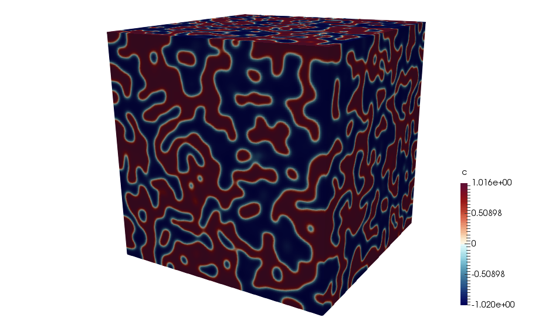

# Summary

```Cahn-Hilliard-CUDA``` is a computational materials science package, which aims to facilitate exascale phase transformation and materials design simulations.
The main feature of ```Cahn-Hilliard-CUDA``` is porting phase-field simulation into the GPU (Graphical Processing Units) in order to speed up the simulations.
The GPU computing program design needs clever memory allocation and transfer from/into CPU in order to achieve considerable speed up.
As a result, all the numerical calculations in the ```Cahn-Hilliard-CUDA``` package are done within device kernels and only the at time of I/O the result will be transferred to the CPU.
Also the ```Cahn-Hilliard-CUDA``` is written in a modular way which could facilitate future developments and include more complex materials design models.

# Mathematics

The main theory behind the ```Cahn-Hilliard-CUDA``` is nonlinear diffusion equation based double-well chemical potential. This equation (i.e. Cahn-Hilliard equation) could be written as:

$$\frac{\partial c}{\partial t} = D \nabla^{2} (c^{3}-c-\gamma \nabla^{2} c)$$

Where $D$ is the diffusion coefficient and $\gamma$ controls interface thickness between two phases of different materials.
In fact the nonlinear term of $\mu = c^{3}-c-\nabla^{2} c$ is the definition of chemical potential and is extracted from minimizing this Lyaponov free energy functional as:

$$F = \int_{v} [\frac{1}{4}(c^{2}-1)^{2} \frac{\gamma}{2} |\nabla c|^{2}] dv$$

Where $F$ is the free energy functional and $v$ is the volume of interest. In ```Cahn-Hilliard-CUDA``` the above equation is discretized by using Crank-Nicolson method in order to find the numerical solution as:

$$c_{new}^{t+1} = c_{old}^{t} + D \Delta t (\frac{\mu^{x+1,y,z}+\mu^{x-1,y,z}-2\mu^{x,y,z}}{\Delta x^{2}} + \frac{\mu^{x,y+1,z}+\mu^{x,y-1,z}-2\mu^{x,y,z}}{\Delta y^{2}} + \frac{\mu^{x,y,z+1}+\mu^{x,y,z-1}-2\mu^{x,y,z}}{\Delta z^{2}})$$

# Figures

Spinodal decomposition of two immiscible materials: 

# Acknowledgements

We acknowledge Palmetto cluster of Clemson University, USA for giving us the time to run the simulations.

# References
